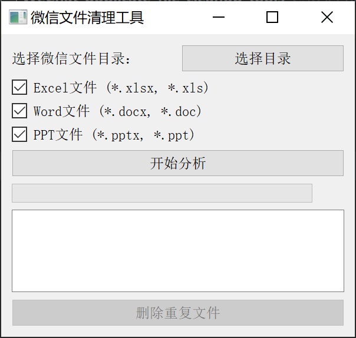

# 微信文件重复清理工具

这是一个用于清理微信文件夹中重复文件的图形界面工具。当微信转发文件时，会在本地生成多个相同内容的副本，占用大量磁盘空间。这个工具可以帮助你识别并清理这些重复文件。

## 页面截图




## 功能特点

- 图形化界面，操作简单直观
- 支持多种文件类型筛选（Excel、Word、PPT等）
- 使用MD5算法精确识别重复文件
- 多线程扫描，提高处理速度
- 显示详细的扫描统计信息
- 安全的文件删除机制（保留每个文件的一个副本）

## 使用方法

1. 运行程序：
```python
python wechat_cleaner.py
```

2. 在界面上选择微信文件存储目录（通常在 `WeChat Files` 文件夹下）

3. 选择要扫描的文件类型（可多选）：
   - Excel文件 (*.xlsx, *.xls)
   - Word文件 (*.docx, *.doc)
   - PPT文件 (*.pptx, *.ppt)

4. 点击"开始分析"按钮，等待扫描完成

5. 查看扫描结果，包括：
   - 总文件数
   - 重复文件数
   - 总文件大小
   - 可节省空间大小

6. 确认后，点击"删除重复文件"按钮清理重复文件

## 注意事项

- 首次使用前建议备份重要文件
- 删除操作不可撤销
- 程序会保留每个重复文件组中的第一个文件
- 需要确保对目标文件夹有读写权限

## 技术特点

- 使用PyQt5构建图形界面
- 采用多线程处理，提高性能
- 使用SQLite数据库存储扫描结果
- 分块读取大文件，节省内存
- 完善的错误处理机制

## 依赖库

- Python 3.6+
- PyQt5
- sqlite3（Python标准库）

## 安装依赖

```bash
pip install PyQt5
```

## 项目结构

```
├── wechat_cleaner.py  # 主程序和GUI界面
├── scanner.py         # 文件扫描器
├── db_manager.py      # 数据库管理
└── README.md          # 说明文档
```

## 开发者信息

如果遇到问题或有改进建议，欢迎提出Issue或Pull Request。
感谢[cursor](https://www.cursor.com/)


## 许可证

MIT License

## 免责声明

本工具仅用于清理重复文件，请在使用前备份重要数据。作者不对因使用本工具导致的任何数据丢失负责。


